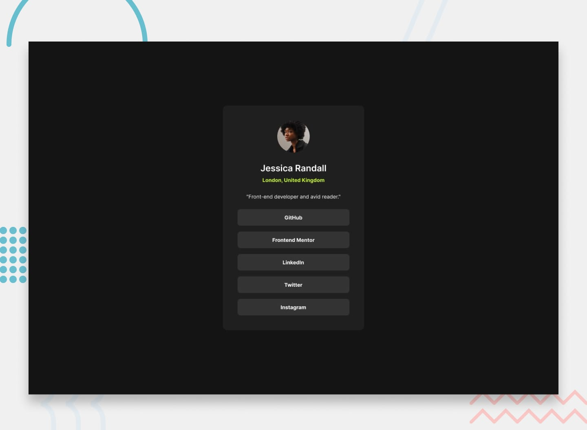

# Frontend Mentor - Social links profile

## Welcome! 👋

Thanks for checking out this front-end coding challenge.

[Frontend Mentor](https://www.frontendmentor.io) challenges help you improve your coding skills by building realistic projects.
## Description

This project is a front-end coding challenge from Frontend Mentor. The goal is to create a social links profile page based on the provided design.

## Technologies Used

- HTML
- CSS
- JavaScript

## Getting Started

To get started with this project, follow these steps:

1. Clone the repository: `https://github.com/akash2704/Social-Link-Profile-Main.git`
2. Open the project in your favorite code editor.
3. Start coding and customize the project to match the design.

## Design Preview

You can find the design preview for this coding challenge in the `./design` directory. The `desktop-preview.jpg` file shows how the final result should look like.

## Contributing

Contributions are welcome! If you have any suggestions or improvements, feel free to open an issue or submit a pull request.

